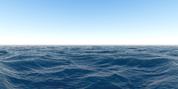

# Seascape Shader

A raymarched procedural ocean rendered in a single HTML file with vanilla WebGL — animated waves, sky, and sun, with mouse interaction. Based on the classic Shadertoy "Seascape" (by TDM), ported from a Rust version.

**Live:** https://razodin137.github.io/seascape-glsl/

